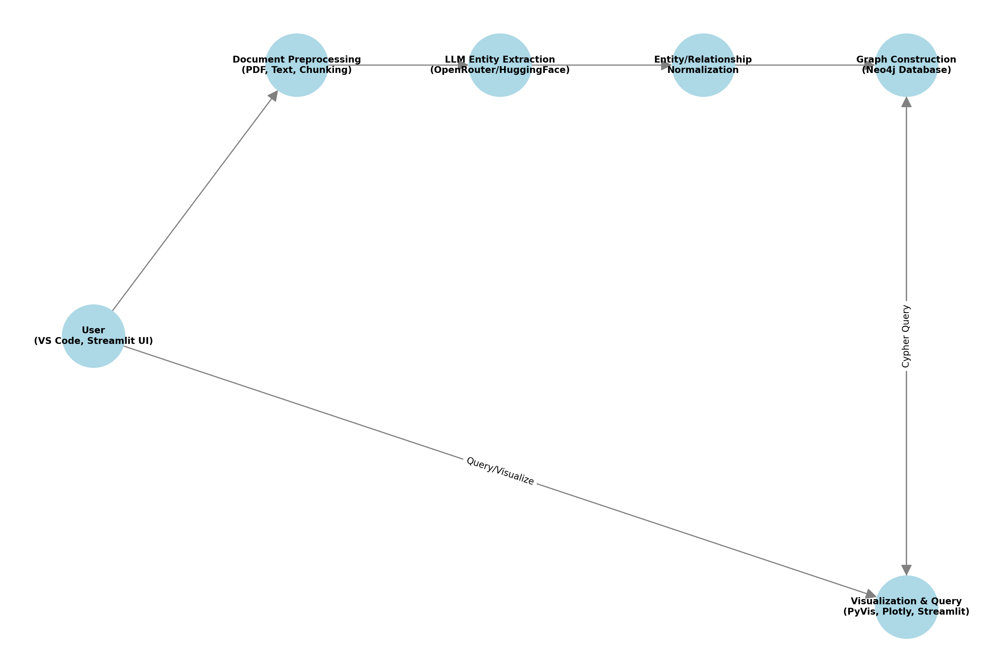
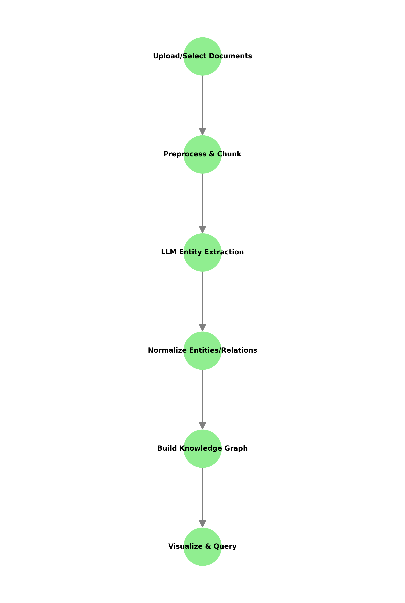

# Financial Knowledge Graph System



## Overview
A powerful, modular system for extracting, constructing, and visualizing financial knowledge graphs from unstructured documents (PDFs, reports, news, etc.) using LLMs (OpenRouter, HuggingFace), Neo4j, and modern Python tools. Features advanced chunking, entity/relationship extraction, graph analytics, and a Streamlit web UI.

---

## Features
- **Document Preprocessing**: PDF/text extraction, cleaning, advanced chunking (configurable size/overlap)
- **LLM Entity Extraction**: Use OpenRouter or HuggingFace models for robust entity/relationship extraction
- **Graph Construction**: Build rich knowledge graphs in Neo4j with advanced schema
- **Visualization**: Interactive dashboards using Streamlit, PyVis, Plotly, **matplotlib**, and **networkx**
- **Natural Language Query**: NL-to-Cypher with LLMs for querying the graph
- **Configurable**: All major parameters (chunk size, overlap, models, etc.) in `config.py`
- **Cross-platform**: Works on Windows, Linux, Mac (with minor adjustments)
- **Extensible**: Modular codebase for research, experimentation, and production

---

## Quick Start (Windows + VS Code)

### 1. Prerequisites
- **Python**: 3.9–3.11 recommended
- **VS Code**: [Download](https://code.visualstudio.com/)
- **Neo4j Desktop**: [Download](https://neo4j.com/download/)
- **Git**: [Download](https://git-scm.com/download/win)

### 2. Clone the Repository
```sh
git clone <your-repo-url>
cd bda-knowledge-graph
```

### 3. Set Up Python Environment
```sh
python -m venv .venv
.venv\Scripts\activate
pip install --upgrade pip
pip install -r requirements.txt
```

### 4. Configure Environment Variables
- Copy `env_example.sh` to `.env` and fill in your API keys and Neo4j credentials, or set them in your system environment.
- Edit `config.py` for chunk size, model, etc. as needed.

### 5. Get API Keys
- **OpenRouter**: [Sign up](https://openrouter.ai/) → [API Keys](https://openrouter.ai/account/keys)
- **HuggingFace**: [Sign up](https://huggingface.co/) → [Access Tokens](https://huggingface.co/settings/tokens)

### 6. Set Up Neo4j Database
- Launch Neo4j Desktop
- Create a new project & database (default: `neo4j`/`password`)
- Set `NEO4J_URI`, `NEO4J_USER`, `NEO4J_PASSWORD` in `.env` or `config.py`
- Start the database

### 7. Run the Streamlit App
```sh
streamlit run streamlit_app.py
```
- Open the provided local URL in your browser
- Upload PDFs or use sample documents
- Extract, build, visualize, and query your knowledge graph!

---

## Alternative Setup (Linux/Mac)
- Use `python3 -m venv venv && source venv/bin/activate`
- Neo4j Desktop or [Neo4j Community Server](https://neo4j.com/download-center/#community)
- All other steps are similar

---

## Project Structure
```
├── config.py                # All configuration (chunk size, models, Neo4j, etc.)
├── requirements.txt         # Python dependencies
├── streamlit_app.py         # Main web UI
├── src/                     # Core modules
│   ├── preprocessing/       # PDF/text cleaning, chunking
│   ├── llm_extraction/      # LLM clients, entity extraction
│   ├── graph_builder/       # Neo4j client, graph construction
│   ├── visualization/       # Graph/network visualization
│   └── query_interface/     # NL-to-Cypher, query interface
├── data/                    # Input and processed data
├── outputs/                 # Visualizations, exports
├── docs/                    # Documentation, diagrams
│   └── architecture_diagrams.py  # Generates diagrams
```

---

## Architecture & Workflow

### System Architecture


### Processing Workflow


To regenerate diagrams:
```sh
python docs/architecture_diagrams.py
```

---

## Configuration & Customization
- **Chunk Size/Overlap**: `CHUNK_SIZE`, `CHUNK_OVERLAP` in `config.py` (affects LLM cost, context)
- **Models**: Set `LLM_MODEL` for OpenRouter, or select in Streamlit UI
- **Neo4j**: URI, user, password in `.env` or `config.py`
- **Max Chunks**: Limit per document in Streamlit sidebar
- **Advanced Graph Features**: Custom entity/relationship types, graph analytics, subgraph extraction

---

## Common Errors & Troubleshooting
- **Neo4j Connection**: Ensure Neo4j is running, credentials are correct, and Bolt port is open
- **API Key Errors**: Double-check OpenRouter/HuggingFace keys, check usage limits
- **Chunking Issues**: If only 1 chunk is created, check for section headers in your document or adjust chunking logic
- **Python Version**: Use Python 3.9–3.11 for best compatibility
- **Missing Packages**: Run `pip install -r requirements.txt`

---

## Tips & Best Practices
- Use smaller chunk sizes for more granular extraction, but beware of LLM context/token limits
- Use the Streamlit UI for rapid experimentation and visualization
- For large-scale or automated runs, use the Python modules directly
- Regularly backup your Neo4j database
- Use `.env` for secrets, never commit API keys

---

## IDEs & Development
- **Recommended**: VS Code (with Python, Pylance, Jupyter, and Streamlit extensions)
- **Others**: PyCharm, JupyterLab, or any Python IDE

---

## Requirements
- Python 3.9–3.11
- See `requirements.txt` for all packages
- Visualization: `matplotlib`, `networkx`, `pyvis`, `plotly` (see `requirements.txt`)

---

## License & Citation
- For academic use and purposes only.

---

## Contact & Support
- For issues, open a GitHub issue or contact the maintainer.

---
